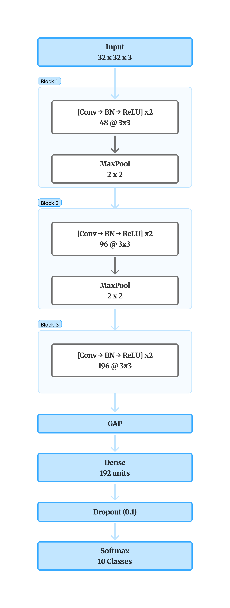
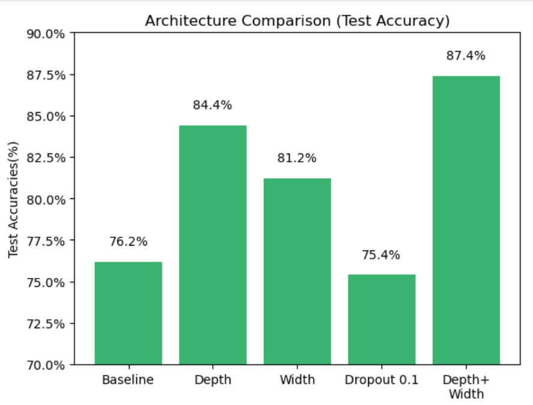
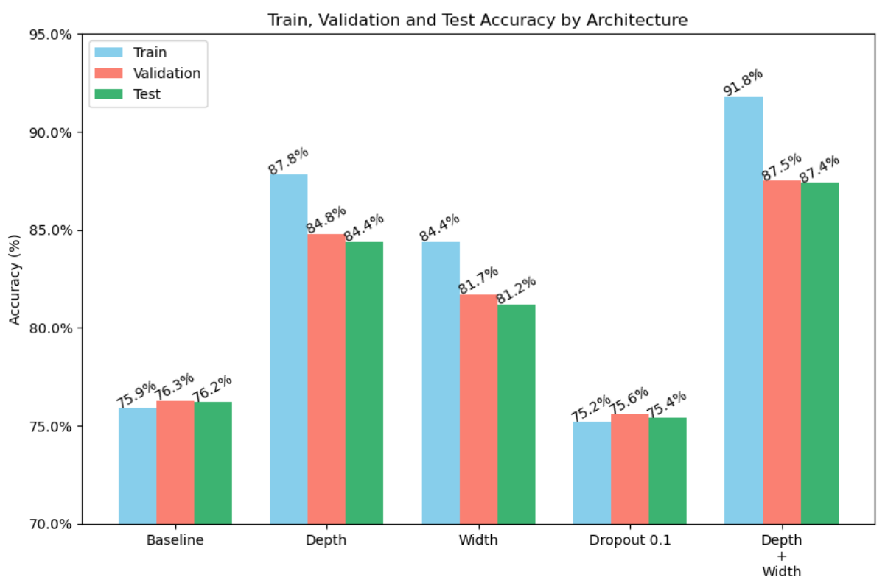

# CIFAR-10 Custom CNN Classifier

A custom Convolutional Neural Network (CNN) built from scratch in TensorFlow/Keras for image classification on the CIFAR-10 dataset.

Unlike transfer learning projects, this model was designed and improved through a series of architecture experiments to understand how network depth and width affect model performance.

---

## Features

* Custom CNN architecture (built from scratch)
* Batch Normalization
* Data Augmentation
* Global Average Pooling
* Dropout Regularization
* Early Stopping
* Model Checkpointing

---

## Dataset

* CIFAR-10
* 10 image classes
* 60,000 RGB images
* Image size: 32 × 32

---

## Final Architecture

* 6 Convolutional Layers
* Filter sizes: 48 → 48 → 96 → 96 → 192 → 192
* Batch Normalization after every convolution
* ReLU activation
* Max Pooling
* Global Average Pooling
* Dense (128)
* Dropout (0.1)
* Softmax Output (10 classes)
  
<p align="center">
  
</p>

---

## Final Results

| Metric              |  Accuracy |
| ------------------- | --------: |
| Train Accuracy      | **91.8%** |
| Validation Accuracy | **87.5%** |
| Test Accuracy       | **87.4%** |

### Test Accuracy Comparison

<p align="center">
  
</p>

Comparison of test accuracy across different CNN architectures. Increasing network depth produced the largest performance improvement, while combining increased depth and width achieved the best overall accuracy (87.4%).

### Train, Validation and Test Accuracy

<p align="center">
  
</p>

Training, validation, and test accuracy for each experiment. The final model achieved the highest training accuracy while maintaining good generalization.

---

## Key Findings

During this project, multiple CNN architectures were evaluated to study the effect of different design choices.

Major observations include:

* Increasing **network depth** produced the largest improvement in accuracy.
* Increasing **network width** also improved performance, but less than increasing depth.
* Lowering the dropout rate alone did not improve the baseline model.
* Combining increased depth and width produced the best overall performance.

A complete record of every experiment and its conclusions is available in **experiments.md**.

---

## Repository Structure

```
cnn-cifar10-classifier/
│
├── images/
├── models/
├── notebooks/
├── experiment_log.md
├── README.md
└── requirements.txt
```

---

## Future Work

* Train the final architecture for additional epochs using Early Stopping.
* Deploy the classifier with Streamlit.

---

## Concepts Practiced

* Convolutional Neural Networks (CNNs)
* Network Depth vs. Width
* Batch Normalization
* Dropout Regularization
* Global Average Pooling
* Data Augmentation
* Model Evaluation
* Experimental Architecture Design

